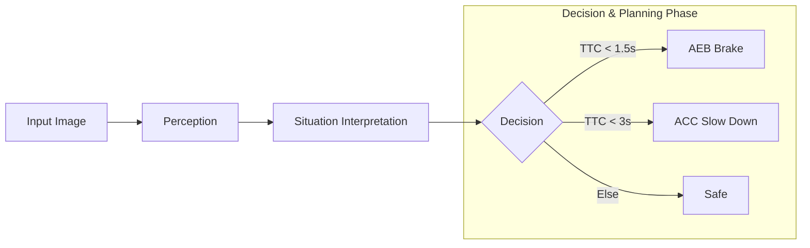

# ADAS 1V Solution AEB/ACC Demo

## Overview
This project demonstrates:
- YOLOv8 object detection : Currently the model can detect 80 types of objects, with detection time = 4.9 ms
- Distance estimation using bounding boxes
- Time-to-Collision (TTC)
- AEB and ACC decision logic

## Run
pip install ultralytics opencv-python
python AEBACC.py

## Env Setup
### System Setup
- Ubuntu 20.04.6 LTS
### Conda Installation
- Download Miniconda -->         wget https://repo.anaconda.com/miniconda/Miniconda3-latest-Linux-x86_64.sh
- Install -->                  bash Miniconda3-latest-Linux-x86_64.sh
- Restart terminal or run -->   source ~/.bashrc
- Verify -->                 conda --version

### Yolo & Dependencies Installation
  - pip install ultralytics
  - pip install opencv-python numpy

### Flowchart

## Results

### Next Steps
  - To Make run on Renases V3H Plaform
  - monocular approximation to near true-depth estimation
  - Add FCW Feature

adas/
 ├── main.py                 # pipeline orchestration
 ├── config/
 │    └── config_loader.py   # OTA config
 ├── services/
 │    ├── fcw_service.py
 │    ├── acc_service.py
 │    └── aeb_service.py
 ├── perception/
 │    └── detector.py
 └── utils/

