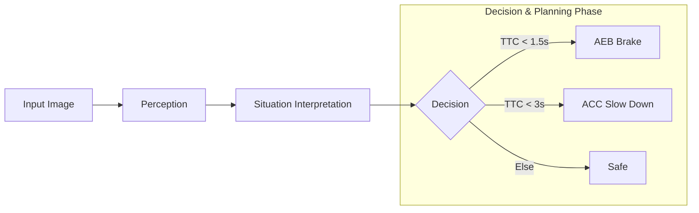

# ADAS 1V Solution AEB/ACC Demo

## Overview
This project demonstrates:
- YOLOv8 object detection : Currently the model can detect 80 types of objects, with detection time = 4.9 ms
- Distance estimation using bounding boxes
- Time-to-Collision (TTC)
- AEB and ACC decision logic

## Run
pip install ultralytics opencv-python
python AEBACC.py

## Env Setup
### System Setup
- Ubuntu 20.04.6 LTS
### Conda Installation
- Download Miniconda -->         wget https://repo.anaconda.com/miniconda/Miniconda3-latest-Linux-x86_64.sh
- Install -->                  bash Miniconda3-latest-Linux-x86_64.sh
- Restart terminal or run -->   source ~/.bashrc
- Verify -->                 conda --version

### Yolo & Dependencies Installation
  - pip install ultralytics
  - pip install opencv-python numpy

### Flowchart

## Results

## SDV Ready

  
ADAS System Structure

  <ul>
    <li><b>main.py</b> – Pipeline orchestration</li>

    <li>
      

        
config/

        <ul>
          <li><b>config_loader.py</b> – OTA config</li>
        </ul>
      

    </li>

    <li>
      

        
services/

        <ul>
          <li><b>fcw_service.py</b> – Forward Collision Warning</li>
          <li><b>acc_service.py</b> – Adaptive Cruise Control</li>
          <li><b>aeb_service.py</b> – Automatic Emergency Braking</li>
        </ul>
      

    </li>

    <li>
      

        
perception/

        <ul>
          <li><b>detector.py</b> – YOLO Detection</li>
        </ul>
      

    </li>

    <li>
      

        
utils/

        <ul>
          <li>(helper modules)</li>
        </ul>
      

    </li>

  </ul>

### Next Steps
  - To Make run on Renases V3H Plaform
  - monocular approximation to near true-depth estimation
  - Add FCW Feature

