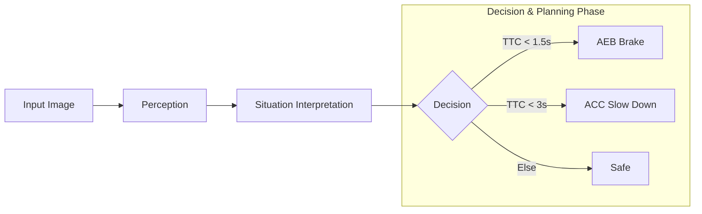

# SDV-Aligned ADAS Solution

## Overview

This project demonstrates an **SDV-aligned ADAS architecture**, where perception and decision-making are implemented as **decoupled, reusable services**.

The solution showcases:

- Vision-based perception using YOLOv8
- Real-time decision services (FCW, ACC, AEB)
- Configurable and modular pipeline
- Foundation for Service-Oriented Architecture (SOA)

This is not just a demo—it is a **prototype of how ADAS functions can be structured in a Software-Defined Vehicle (SDV)**.

---

## Env Setup
### System Setup
- Ubuntu 20.04.6 LTS
- scp CARLA_0.10.0.tar.gz uid39463@10.103.186.189:/home/uid39463/
### Conda Installation
- Download Miniconda -->         wget https://repo.anaconda.com/miniconda/Miniconda3-latest-Linux-x86_64.sh
- Install -->                  bash Miniconda3-latest-Linux-x86_64.sh
- Restart terminal or run -->   source ~/.bashrc
- Verify -->                 conda --version

### Yolo & Dependencies Installation
  - pip install ultralytics
  - pip install opencv-python numpy

### Flowchart

## Results

## SDV Evolution Roadmap

### Phase 1 (Current)
- Monolithic execution with modular services

### Phase 2
- Introduce middleware (ROS2 / DDS / SOME-IP)
- Convert services into independent processes

### Phase 3
- Deploy on central compute
- Enable inter-service communication

### Phase 4
- Cloud integration
- OTA updates for decision logic
- Data-driven continuous improvement

